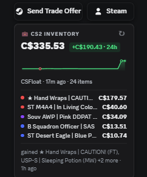
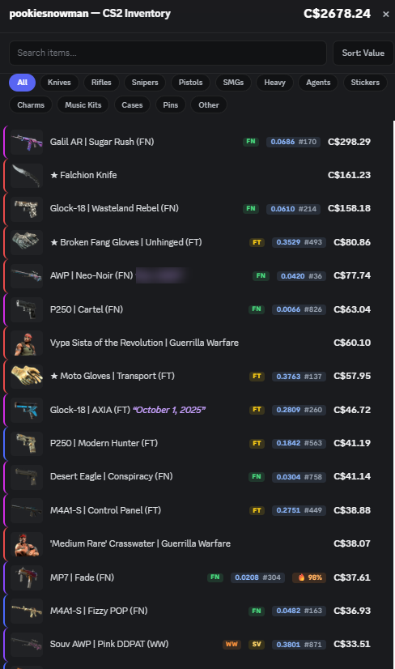

<div align="center">

# CS2 Inventory — BetterDiscord

**Shows anyone's CS2 inventory value, floats & patterns right on their Discord profile.**

Real floats & paint seeds · Doppler phase pricing · live prices in your currency · Trade Offer & Steam buttons · a shared cache so it loads instantly for everyone.

[](https://github.com/VisaHolder/cs2-inventory-betterdiscord/releases/latest/download/CS2Inventory.plugin.js) &nbsp; [](https://github.com/VisaHolder/cs2-inventory-betterdiscord/releases/latest) &nbsp; [](LICENSE)

<br>

|  On a profile  |  The full breakdown  |
|:---:|:---:|
|  |  |

<sub>The card on a profile — value, sparkline, top items, what changed. Click it for the full breakdown: real <b>floats</b> & <b>paint seeds</b>, 🔥 <b>fade %</b> / 💎 <b>blue gem</b>, wear tags, name tags, and per-type filters.</sub>

</div>

---

## Install (2 minutes)

1. **Get BetterDiscord** (skip if you have it) — https://betterdiscord.app
2. **Download** [`CS2Inventory.plugin.js`](https://github.com/VisaHolder/cs2-inventory-betterdiscord/releases/latest/download/CS2Inventory.plugin.js)
3. In Discord: **Settings → Plugins → Open Plugins Folder** — drop the file in
4. Back in **Settings → Plugins**, turn **CS2Inventory** on

Open anyone's profile (with a linked Steam) and their CS2 inventory value shows up.

> **Optional — exact Doppler phase prices.** Grab a free CSFloat key (csfloat.com → Profile → Developer) and paste it into the plugin's settings. Rubies, Sapphires, Black Pearls and Phases then price correctly instead of the generic Doppler number.

Full guide: [`betterdiscord/README.md`](betterdiscord/README.md)

## Features

- **Inventory value** on every profile — total in your currency (CSFloat prices + live FX), top items with rarity-colored tiers, item count
- **Doppler / Gamma Doppler phase pricing** — Ruby, Sapphire, Black Pearl, Emerald, Phase 1-4 (with the optional CSFloat key)
- **Real floats + paint seeds** — every skin's exact wear value and pattern index, on *any* public inventory, pulled straight from Steam (no login, no key)
- **Fade % & Blue Gem %** — computed from the seed: 🔥 fade percentage on Fade / Amber / Acid skins, 💎 blue coverage on Case Hardened & Heat Treated
- **Low-float / high-float flags** — 🥇 badges on ranked top-tier wears (FloatDB thresholds), on any inventory
- **Full breakdown** — click any card for a searchable list of every item: thumbnails, real float + seed, color-graded wear (FN→BS), rarity colors, StatTrak™ / Souvenir tags, custom name tags, applied-sticker names, and a **trade-hold / locked** flag (with an unlock countdown on your own items). Sort by **value / float / name**, and filter by weapon type or **rarity grade**. Left-click an item for its Steam Market page (or configure it to inspect in-game / price on CSFloat / Buff163 / open the owner's inventory); right-click for a tidy grouped menu — **inspect** (in-game, copy inspect link), **prices** (CSFloat, Buff163, Steam Market, CSGOStash), **owner inventory**, **post the item to chat**, and — when the owner has shared their trade URL — **create trade for this item** (opens a Steam web trade offer with that exact item pre-added). Right-click a user for the same breakdown
- **Price history at a glance** — a sparkline with all-time-high / low markers, a gain/loss delta chip, and a value-milestone badge ($1K / $5K / $10K …)
- **What changed** — each card shows items gained/dropped since last time
- **Trade Offer + Steam Profile buttons**, auto-detected from a linked Steam or a shared/bio trade URL
- **Shared cache** — once anyone prices a profile it loads instantly for everyone else, and phase-accurate prices propagate even to users without a key
- 100% client-side; only your **public** SteamID and inventory value are ever shared — no Discord identity, no accounts
- Optional **applied-sticker value** toggle (off by default — applied stickers rarely resell for much)

## Commands

- `/inventory` — price a user or Steam ref; posts publicly (labeled links) or as an only-you embed with clickable Steam / Trade links
- `/price <item>` — look up any skin's market price, exact or fuzzy match
- `/leaderboard` — the richest CS2 inventories the addon has tracked (add `here` for just this server)
- `/compare a b` — two inventories side by side, and who wins by how much

## Repo layout

| Path | What |
|------|------|
| [`betterdiscord/`](betterdiscord) | The plugin — TypeScript source + esbuild build, producing the drag-and-drop `.plugin.js` |
| [`worker/`](worker) | `vsi-cache` — the Cloudflare Worker + KV backing the shared inventory-value cache |

## Build

```bash
cd betterdiscord && npm install && npm run build   # -> CS2Inventory.plugin.js
```

The worker deploys via the **Deploy Worker** GitHub Action (`workflow_dispatch`), or `cd worker && npm i && wrangler deploy`.

## License

[MIT](LICENSE) (c) VisaHolder
