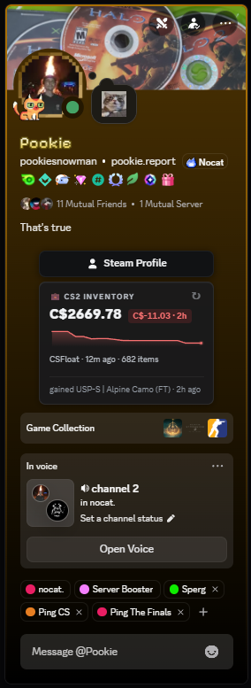

<div align="center">

# Steam Inventory Value

**A BetterDiscord plugin that shows anyone's CS2 inventory value right on their Discord profile.**

Real Doppler phase pricing · live prices in your currency · Trade Offer & Steam buttons · a shared cache so it loads instantly for everyone.

[](https://github.com/VisaHolder/steam-inventory-value/releases/latest/download/SteamInventoryValue.plugin.js) &nbsp; [](https://github.com/VisaHolder/steam-inventory-value/releases/latest) &nbsp; [](LICENSE)

<br>


&nbsp;

&nbsp;

&nbsp;


<sub>Each inventory shown two ways — <b>full</b> (with top items) and <b>compact</b> (total + sparkline only). The sparkline is green when the value's up, red when it's down.</sub>

</div>

---

## Install (2 minutes)

1. **Get BetterDiscord** (skip if you have it) — https://betterdiscord.app
2. **Download** [`SteamInventoryValue.plugin.js`](https://github.com/VisaHolder/steam-inventory-value/releases/latest/download/SteamInventoryValue.plugin.js)
3. In Discord: **Settings → Plugins → Open Plugins Folder** — drop the file in
4. Back in **Settings → Plugins**, turn **SteamInventoryValue** on

Open anyone's profile (with a linked Steam) and their CS2 inventory value shows up.

> **Optional — exact Doppler phase prices.** Grab a free CSFloat key (csfloat.com → Profile → Developer) and paste it into the plugin's settings. Rubies, Sapphires, Black Pearls and Phases then price correctly instead of the generic Doppler number.

Full guide: [`betterdiscord/README.md`](betterdiscord/README.md)

## Features

- **Inventory value** on every profile — total in your currency (CSFloat prices + live FX), top items, item count
- **Doppler / Gamma Doppler phase pricing** — Ruby, Sapphire, Black Pearl, Emerald, Phase 1-4 (with the optional CSFloat key)
- **Full breakdown** — click any card for a searchable, sortable list of every item with thumbnails; right-click a user for the same
- **What changed** — each card shows items gained/dropped since last time
- **Trade Offer + Steam Profile buttons**, auto-detected from a linked Steam or a shared/bio trade URL
- **Shared cache** — once anyone prices a profile it loads instantly for everyone else, and phase-accurate prices propagate even to users without a key
- 100% client-side; only your **public** SteamID and inventory value are ever shared — no Discord identity, no accounts
- Optional **applied-sticker value** toggle (off by default — applied stickers rarely resell for much)

## Commands

- `/inventory` — price a user or Steam ref; posts publicly (labeled links) or as an only-you embed with clickable Steam / Trade links
- `/leaderboard` — the richest CS2 inventories the addon has tracked
- `/compare a b` — two inventories side by side, and who wins by how much

## Repo layout

| Path | What |
|------|------|
| [`betterdiscord/`](betterdiscord) | The plugin — TypeScript source + esbuild build, producing the drag-and-drop `.plugin.js` |
| [`worker/`](worker) | `vsi-cache` — the Cloudflare Worker + KV backing the shared inventory-value cache |

## Build

```bash
cd betterdiscord && npm install && npm run build   # -> SteamInventoryValue.plugin.js
```

The worker deploys via the **Deploy Worker** GitHub Action (`workflow_dispatch`), or `cd worker && npm i && wrangler deploy`.

## License

[MIT](LICENSE) (c) VisaHolder
